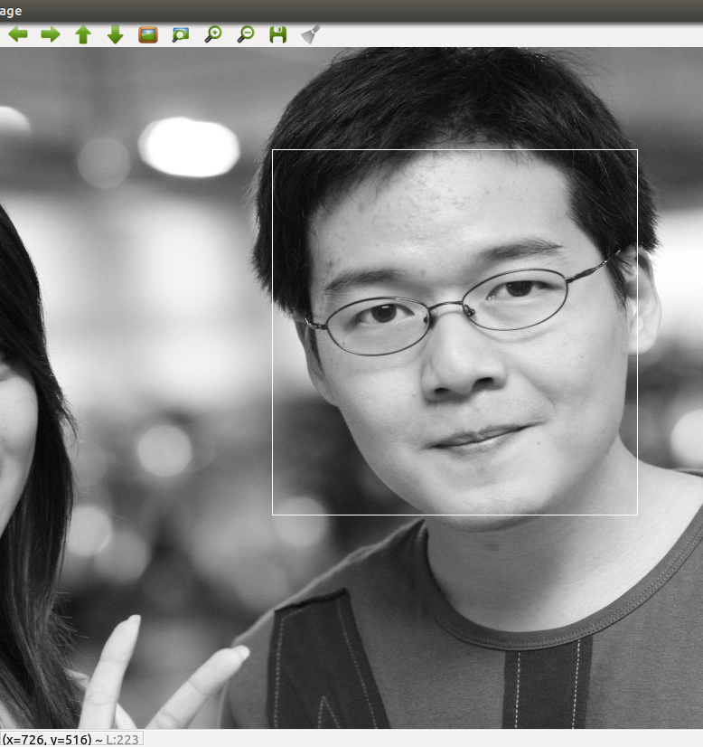

# Face Alignment at 3000fps
It is an implementation of [Face Alignment at 3000fps via Local Binary Features](http://research.microsoft.com/en-US/people/yichenw/cvpr14_facealignment.pdf), a paper on CVPR 2014

# Interpret the Paper's details 
If you are a Chinese, you can go to my blog for more details. [link](http://freesouls.github.io/2015/06/07/face-alignment-local-binary-feature/)

# License
If you use my work, please cite my name (Binbin Xu), Thanks in advance.
This project is released under the BSD 2-Clause license.

#How To Use
####Requirements:
1. OpenCV(I just use the basic structures of OpenCV, like cv::Mat, cv::Point)
2. cmake

####Prepare: 
1. you should change some image PATH in main.cpp and utils.cpp(function LoadImages) for correctly running the program.
2. set appropriate parameters in Train() (in the file of main.cpp)

####Compile:
```
mkdir release
cp CMakeList.txt ./release
cd release
cmake .
make
./application train ModelName # when training
./application test ModelName # when testing 
./application test ModelName imageName # when testing one image
```
# Important
If you try to resize the images, please use the codes below
``` c++
if (image.cols > 2000){
    cv::resize(image, image, cv::Size(image.cols / 3, image.rows / 3), 0, 0, cv::INTER_LINEAR);
    ground_truth_shape /= 3.0;
}
```
DO NOT SWAP "image.cols" and "image.rows", since "image.cols" is the width of the image, the following lines are WRONG!!!
``` c++
if (image.cols > 2000){
    cv::resize(image, image, cv::Size(image.rows / 3, image.cols / 3), 0, 0, cv::INTER_LINEAR);
    ground_truth_shape /= 3.0;
}
```
##what are .pts files
[here](http://ibug.doc.ic.ac.uk/resources/300-W/) you can download dataset with .pts files, each .pts file contains 68 landmarks positions in the image

##what are .box files
.box is just the bounding box of a face, including the center point of the box, you can just use the face rectangle detected by opencv alogrithm with a little effort calculating the center point's position yourself. Example codes  are like below
``` c++
BoundingBox bbox;
bbox.start_x = faceRec.x; // faceRec is a cv::Rect, containing the rectangle of the face
bbox.start_y = faceRec.y;
bbox.width = faceRec.width;
bbox.height = faceRec.height;
bbox.center_x = bbox.start_x + bbox.width / 2.0;
bbox.center_y = bbox.start_y + bbox.height / 2.0;
bboxes.push_back(bbox);
```
# Notes
- The paper claims for 3000fps for 51 landmarks and high frame rates for different parameters, while my implementation can achieve several hundreds frame rates. What you should be AWARE of is that we both just CALCULATE the time that predicting the landmarks, EXCLUDES the time that detecting faces.
- If you want to use it for realtime videos, using OpenCV's face detector will achieve about 15fps, since 80% (even more time is used to get the bounding boxes of the faces in an image), so the bottleneck is the speed of face detection, not the speed of landmarks predicting. You are required to find a fast face detector(For example, [libfacedetection](https://github.com/ShiqiYu/libfacedetection))
- In my project, I use the opencv face detector, you can change to what you like as long as using the same face detector in training and testing
- it can both run under Windows(use 64bits for large datasets, 32bits may encounter memory problem) and Unix-like(preferred) systems.
- it can reach 100~200 fps(even 300fps+, depending on the model) when predicting 68 landmarks on a single i7 core with the model 5 or 6 layers deep. The speed will be much faster when you reduce 68 landmarks to 29, since it uses less(for example, only 1/4 in Global Regression, if you fix the random forest parameteres) parameters.
- for a 68 landmarks model, the trained model file(storing all the parameters) will be around 150M, while it is 40M for a 29 landmarks model. 
- the results of the model is acceptable for me, deeper and larger random forest(you can change parameters like tree_depth, trees_num_per_forest_ and so on) will lead to better results, but with lower speed. 


# Results & standard procedures of testing an image:
###1. detect the face

###2. use the mean shape as the initial shape:

###3. predict the landmarks


# Future Development
- I have add up the openMP to use multithread for faster training, it is really fast, takes an hour when the model is 5 layers deep and 10 trees in each forest with about 8000+ augmented images.
- I have already develop the multithread one, but the time for predicting one image is slower than sequential one, since creating and destroying threads cost more time.
- I will optimize it and update it later.
- Second, I will also develop a version on GPU, and will also upload later.

# THANKS and More
Many thanks goes to those appreciate my work.

if you have any question, contact me at declanxu@gmail.com or declanxu@126.com, THANKS.
